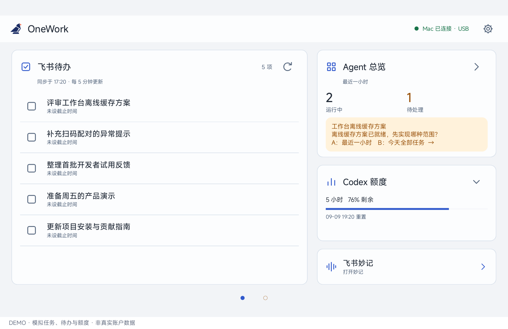
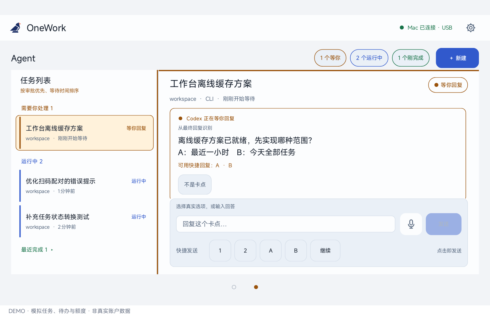

<p align="center"></p>

# OneWork

**让桌前的平板，成为你的工作状态屏。**

在 Mac 上专注开发，在平板上感知 Agent 进展、发现卡点、回复并推进任务。顺手查看飞书待办，不必反复切回各个应用检查“它是不是在等我”。

OneWork 由 **Android 平板应用 + macOS 菜单栏伴侣 + 本地桥接服务**组成。目前优先支持 Codex，面向愿意从源码构建、反馈问题和参与共建的技术开发者。

> 开发者预览版 · 当前版本 0.3.2。尚非面向普通用户的一键安装发行版，macOS 构建仅作本地 ad-hoc 签名，未完成 Developer ID 公证。

[安装与配对](openspec/installation.md) · [开发指南](openspec/development.md) · [参与共建](openspec/contributing.md) · [问题反馈](https://github.com/Bazingabc/onework/issues)

## 它解决什么问题？

多个 Agent 同时工作时，最容易错过的不是任务完成，而是任务已经停下来等你。

OneWork 把“查看状态 → 理解卡点 → 回答问题 → 继续执行”放到一块长期前台、横置在桌面的平板上。它不是电脑远程桌面，也不只是只读看板：在会话允许安全接管或直接操作时，可以从平板发送指令。

## 界面预览

下图使用当前 Android 原生界面渲染。**所有任务、待办和额度均为模拟数据，不是真实账户信息。** 演示应用使用独立包名，移除了联网权限；这些截图用于介绍界面，不代表真实服务性能或额度承诺。

### 首页：今天要做什么，哪些 Agent 需要你



飞书待办、Agent 总览、剩余额度和妙记入口集中展示。底部只保留轻量圆点，左右滑动即可切换首页和 Agent 页面。

### Agent 页面：看到问题，就地推进



左侧查看最近一小时的任务，右侧阅读卡点和必要上下文；可使用文字、语音输入、发送按钮，以及 `1`、`2`、`A`、`B`、`继续` 快捷回复。

[截图数据与重新生成方法](openspec/screenshots/README.md)

## 已有功能

| 能力 | 当前体验 |
| --- | --- |
| Codex 任务总览 | 展示最近一小时任务，区分运行、等待输入、等待审批、可能需要回复、已完成及异常状态 |
| 卡点感知 | 结合协议事件、可选 Hook 和最终回复分析；自然语言推断会标明不确定性 |
| 平板响应 | 查看问题和上下文，发送文字；通过系统语音输入转为文字，或使用快捷回复；可处理受支持的审批 |
| 智能聚焦 | 连续 15 秒无触控后，状态变化可触发自动聚焦；阅读、草稿、语音和提交等交互由保护策略约束 |
| 飞书待办 | 读取和完成已有待办，完成后再次向云端核实；五分钟缓存刷新，支持手动刷新；暂不支持新建 |
| 飞书妙记 | 拉起平板已安装的飞书妙记入口，不自动录音 |
| Codex 额度 | 展示可用额度窗口的剩余比例；不是费用账单或金额估算 |
| Mac 伴侣 | 菜单栏入口、服务状态、配对二维码、设备型号与权限、CLI 路径配置、授权修复和诊断 |
| 局域网连接 | 扫码申请配对，在 Mac 确认查看或操作权限；TLS 连接、设备撤销和网络变化后的重连 |

**可见不等于可操作。** 在其他 Codex 客户端仍占用任务、审批类型不受支持、数据过期或操作结果待确认时，平板会限制操作，可能需要回到原客户端处理。OneWork 不会仅凭识别出一句问题就强行接管任务。

## 如何开始

准备一台 Mac 和一台 Android 平板。**飞书是可选数据源**，可以先只体验 Codex。

1. 克隆仓库，检查系统、JDK、SDK 和 Codex CLI 版本。
2. 构建并安装 Mac 伴侣应用，配置本机 CLI 和默认工作目录。
3. 构建 Android APK 并安装到平板。
4. 两端连接同一局域网，在平板扫描 Mac 配对码，再到 Mac 确认设备权限。

```sh
git clone https://github.com/Bazingabc/onework.git
cd onework
```

完整可执行步骤见 **[安装指南](openspec/installation.md)**。当前以源码构建为准，不假设已有可下载的 APK / DMG。ADB 可用于首次安装和开发调试；日常同步走 OneWork 自己的局域网连接，**无需长期打开无线 ADB**。

## 工作方式与数据边界

```text
Android 平板
    │ 扫码配对 · TLS 局域网连接
    ▼
Mac 上的 OneWork 伴侣与 Python Bridge
    ├── Codex CLI / app-server → 任务、状态、受支持的响应、额度
    ├── 可选 Codex Hook       → 补充原客户端生命周期事件
    └── 飞书 CLI（可选）       → 当前用户的待办与云端完成核实
```

- 不需要部署 OneWork 公网服务器；不要将桥接端口转发到公网。
- Codex 和飞书的登录凭证由 Mac 上对应客户端管理；平板持有自己的配对凭证，也会接收用于展示的任务和待办内容。
- “本地桥接”不等于“完全离线”：Codex、飞书及具体语音识别服务仍可能依赖各自的网络服务。
- Mac 休眠时暂停同步。局域网自动发现要求菜单栏应用保持运行，关闭窗口即可，无需退出应用。

## 开发与共建

Android 使用原生 Java，macOS 使用 SwiftUI，桥接服务使用 Python。可以只选择其中一端开始贡献，不必先理解整个系统。

- [开发指南](openspec/development.md)：目录职责、本地运行、测试、协议修改与验证边界。
- [贡献指南](openspec/contributing.md)：问题反馈、PR 范围、验收信息和隐私检查。
- [安装排障](openspec/installation.md#常见问题)：配对、签名冲突、授权、网络和过期数据。

欢迎优先反馈安装障碍、Codex 兼容性、网络恢复、设备适配和交互体验。涉及新增 Agent 数据源、协议变更或权限模型的改动，建议先通过 Issue 对齐范围。

## 当前边界

- 当前 Codex CLI 版本门禁为 `>= 0.144.0, < 0.154.0`；以 [运行入口](bridge/__main__.py) 为准。不自动修改用户的 CLI 版本。
- Android 最低声明版本为 Android 9（API 28）；主要为横屏平板设计。声明支持不代表所有机型都已实测。
- 当前同时在线上限为 3 台设备；多设备行为仍需更多实机验证，不承诺任意设备规模。
- 长任务历史或协议异常可能使快照过期。过期时保留提示并限制操作，不保证所有任务规模下都实时。
- 暂无联网自动更新；Mac 安装工具支持预检、备份和显式回退。
- 本仓库尚未提供 `LICENSE`，许可证待维护者确认；不在此默认声明 MIT、Apache-2.0 等授权。

<details>
<summary>为什么代码里还有 Agent Views / MyWork？</summary>

产品从 Agent Views 演进为 MyWork，再统一为 OneWork。Android 源码包名及应用标识已统一为 `com.one.onework`；旧版 `com.oneripple.agentviews` 与新版是独立应用，新版需重新安装、配对，旧版数据不会自动继承。Python 模块名 `agent_views` 和 Mac 数据目录 `~/.agent-views` 保持不变，它们不是额外依赖。

[早期说明](openspec/legacy-agent-views.md)仅作历史参考；当前安装和能力边界以本 README 及安装指南为准。

</details>
